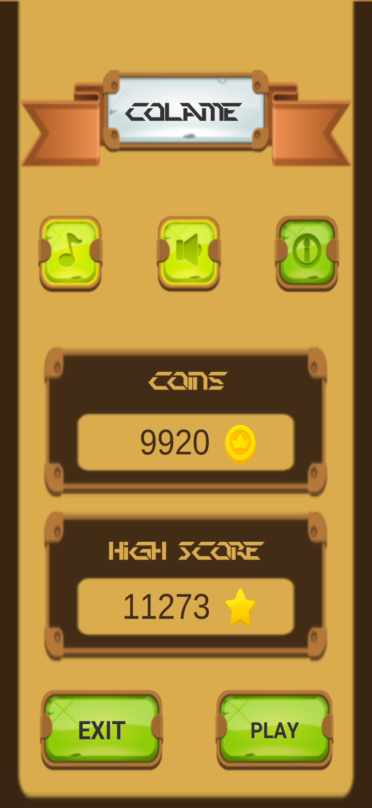
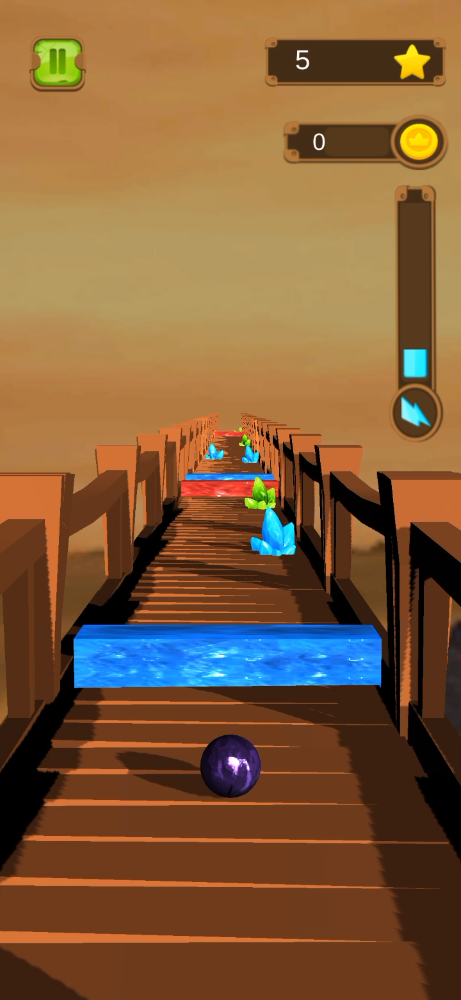
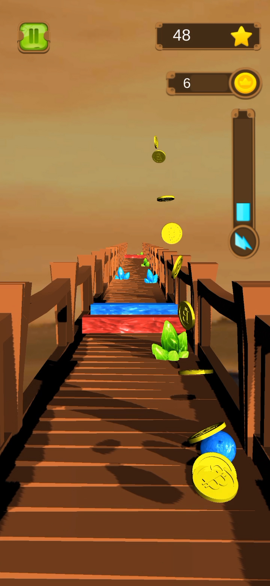
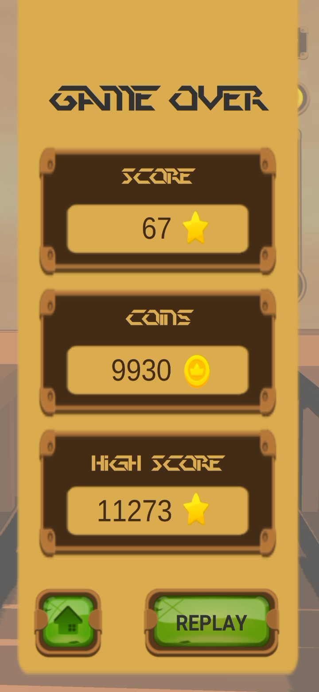
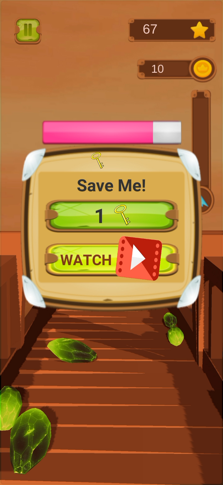
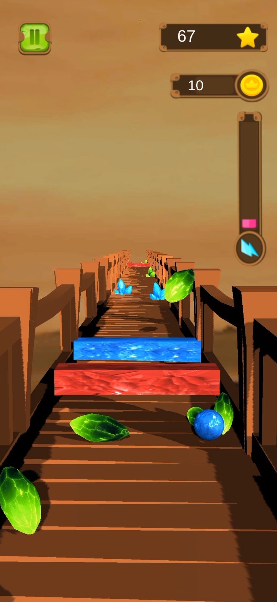

# COLAME
I have created this engaging Unity 3D game that challenges players to navigate a rolling ball across a bridge. The game mechanics involve collecting crystals of the same color to earn points while avoiding crystals of different colors, which result in a loss of speed. To add complexity, I integrated cuboidal hurdles that can dynamically change the ball's color upon collision.
## SCREENSHOTS 
Solarized dark             |  Solarized Ocean
:-------------------------:|:-------------------------:
  |  

:-------------------------:|:-------------------------:
  |  

:-------------------------:|:-------------------------:
  |  

    

    

    

    

    

    

